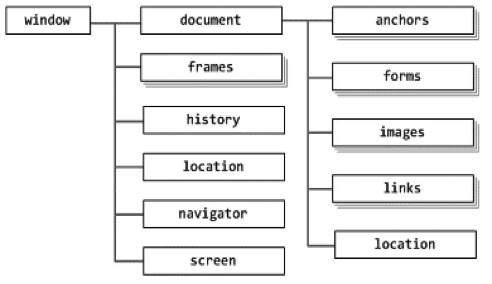

  # JavaScript

  ## Introducción a Páginas Web Dinámicas

  Una páginas web dinámica es 
  aquella que incorpora efectos 
  como:

  - Aparición y desaparición de elementos.
  - Generación de acciones al presionar botones.
  - Mostrar mensajes y avisos al usuario.
  - Animaciones.
  - Transiciones.

  ## Introducción a Javascript

  JavaScript permite mostrar la lógica de negocio y crear páginas web dinámicas con mayor interacción con el usuario.

  Nacido como lenguaje de frontend, la ejecución se realizaba en el navegador del cliente. Es un lenguaje interpretado, no se necesita compilar el código para ejecutarse, se puede probar en el navegador sin la necesidad de instalar otros programas, es un lenguaje de scripting orientado a objetos y no tiene relación con Java.

  Es un lenguaje dinámico, donde no es necesario declarar tipos de datos y las propiedades y valores pueden ser creados, modificados y eliminados en tiempo de ejecución.

  Es un lenguaje funcional, las funciones son objetos en sí mismos, poseen propiedades y métodos predefinidos y se pueden agregar nuevos.

  **Desarrollo Frontend:** Se centra principalmente en las cosas que los usuarios ven cuando ingresan e interactúan con un sitio web, incluyendo tareas de diseño del sitio, la usabilidad y la capacidad de respuesta de cada página. Además, de implementar la lógica de negocios que la aplicación necesita que se ejecute en el cliente del usuario (su navegador).

  **Desarrollo Backend:** Diseñar la sección de la aplicación (ó una nueva aplicación) que se ejecuta en el servidor, que se encargará de responder ante las peticiones que realice cada uno de los clientes. Su objetivo es **proveerle al frontend todo lo necesario para su correcto funcionamiento**, que va desde asegurarle la disponibilidad de datos, hasta realizar validaciones de datos, para su posterior ejecución de altas, bajas y modificaciones de los mismos sobre la **base de datos.** Además, debe **implementar la lógica de negocios** necesaria para que la aplicación se comporta en forma correcta y eficiente.

  ## JavaScript como lenguaje de frontend

  Proporciona funciones y objetos para manipular tanto el navegador como su modelo de datos. Se utiliza para:

  - Modificar dinámicamente el contenido de la página.
  - Ejecutar tareas ante la ocurrencia de algún evento.
  - Procesar los valores de un formulario antes de ser enviados al servidor.
  - Autocompletar campos del formulario o validarlos a medida que son ingresados o previos al submit.
  - Generar animaciones de elementos de la página.

  ## JavaScript como lenguaje de backend

  Es necesario instalar **Node.js**

  **Node.js:** Es un entorno de software, multi-plataforma y de código abierto, que ejecuta JS. Basado en el motor V8 de Google, mezclado con ciertas librerías que permiten entrada y salida de datos en una arquitectura basad en eventos, que permite (entre otras cosas) gestionar peticiones HTTP sobre el servidor.

  De esta forma se puede utilizar JS fuera del navegador para ejecutar tareas del **backend**.

  Las características principales frente a Python y Java son las siguientes:

  - **Event Loop:** Constructor que espera y despacha eventos, mensajes o tareas. No utiliza hilos como los lenguajes sincrónicos y SO. Un hilo es una ejecución de instrucciones que se manejan de manera independiente. Es mono hilo, por lo tanto, un solo flujo que hace uso de un despliegue, gracias a la naturaleza asíncrona de JS.
  - **Velocidad de peticiones:** Tanto las peticiones HTTP como las de E/S se resuelven inmensamente rápido. Una sola instancia puede procesar una inmensa cantidad de peticiones en un hardware muy simple.
  - **Mismo lenguaje en el frontend y el backend:** Simplifica el tiempo destinado al desarrollo y ahorrar capacitaciones a los desarrolladores, lo que hace que conozcan una sola tecnología. El mantenimiento y productividad mejoran al compartir la tecnología.
  - **Reciclado de código:** Se asocia con el punto anterior lo que permite reutilizar código.
  - **Tiempo real:** Cuenta con librerías muy robustas para manejar conexiones (WebSockets), herramientas que se han convertido en parte del set principal de Google (base de datos de Firebase).
  - **NPM:** Administrador de paquetes de Node.js, que cuenta con más de 700K de librerías.

  ## Inserción en Documentos con JS 

  Se debe utilizar la etiqueta script, en un documento puede existir más de un script, c/u se puede definir en la sección del head como en el body. Tiene dos atributos src y type configurables de acuerdo a su origen. Se puede incluir scripts de 2 modos:

  - **Incluir dentro del mismo documento HTML:** Se encierra con las etiquetas script y se incluye en cualquier parte del documento. En versiones anteriores a **HTML5** se debe configurar el atributo type para indicar el tipo de lenguaje de scripting que debe interpretar el navegador: **text/javascript.** Se utiliza para un bloque pequeño de código o instrucciones específicas en un determinado archivo HTML. La desventaja es que si se requiere modificar el código se debe modificar todas las páginas que incluyen ese bloque de código.mll
  - **Definir el script en un archivo externo (Recomendado):** Se referencia en el documento HTML mediante etiqueta script, los archivos JS tienen extension .js y simplifica el código HTML volviéndolo más semántico y se puede reutilizar el código en múltiples páginas del sitio web y el mantenimiento es más simple dado que los cambio se aplican automáticamente a todos los documentos que lo enlazan.

  ## Componentes de JS

  - Script: C/U de los programas, apps o bloques de código creados con JS.
  - Sentencia: Instrucciones que forman un script.

  ## Normas básicas de JS

  - No se tienen en cuenta espacios en blanco y saltos de linea
  - Es case sensitive
  - No se define tipo de variable en su creación
  - Variables dinámicas
  - No es necesario terminar cada sentencia con ;
  - 2 tipos de comentarios: // en linea y /* */ en bloque

  ## Variables

  - Se declaran mediante la palabra var.
  - No es necesario declarar variables para utilizarlas.
  - El nombre debe comenzar con un carácter o los símbolos “” o “$” y puede estar formado por números.
  - Al no inicializarlo, el valor es indefinido.
  - El tipo de variable puede cambiar en ejecución.

  Los valores que puede tomar una variable son:

  **Numéricos:** permite almacenar números enteros o decimales.
      - Enteros	- Decimales: del 0 al 9.	- Octales: del 0 al 7.	- Hexadecimales: del 0 al 9 y de A a F. Comienzan con “0x”.
      - Flotantes	La parte entera se separa de la parte decimal mediante	un punto (“.”).

  **Lógicos:** true/false.

  **Strings:** Conjunto de caracteres

  **Objetos:** Propiedades que definen estado, métodos o funciones para su comportamiento. Es un conjunto de pares nombre:valor.

  **Arreglos:** Colección de variables, del mismo o distintos tipos. Conjunto de elementos encerrados entre corchetes y separados por comas. El primer elemento del array ocupa la posición 0.

  **Null.**

  **Undefined (Indefinido).**

  ### Variables Globales

  - Son declaradas en cualquier parte del programa.
  - Si se declaran fuera de cualquier función automáticamente se transforman en una variable global.
  - Pueden ser declaradas incluso dentro de funciones.
  - Si en el interior de una función no se declaran las variables utilizando la palabra **var**, se transforman automáticamente en variables globales.

  ### Variables Locales

  - Son declaradas dentro de una función específica.
  - Sólo se puede utilizar dentro de la función donde fue declarada.
  - No son reconocidas desde otras funciones o fuera de la función donde se la declara.
  - Si dentro de una función se define una variable con el mismo nombre que una global, las variables locales prevalecen sobre las globales dentro de la función.
  - La utilización de la palabra **var** es obligatoria en la declaración.

  ## Operadores

  Permiten manipular el valor de las variables, realizar operaciones matemáticas y comparar diferentes variables.

  ### Asignación

  ```javascript
  var n1=5
  n1 +=3 // n1=n1+3=8
  n1 -=1 // n1=n1-1=4
  n1 *=2 // n1=n1*2=10
  n1 /=5 // n1=n1/5=1
  n1 %=4 // n1=n1%4=1
  ```

  ### Aritméticos

  ```javascript
  +
  -
  *
  /
  %
  ```

  ### Lógicos


  ```javascript

  && // y

  || // NO

  ! // O
  ```

  ### Relacionales

  ```javascript

  <, >,	 <=, >=, ==, !=, ===, !==

  ==  // Devuelve true si son iguales. Fuerza conversiones de tipo

  !=   // Devuelve true si son distintos. Fuerza conversiones de tipo

  === // Devuelve true si son iguales y del mismo tipo

  !== //  Devuelve true si son distintos y de distinto tipo
  ```

  ## Condiciones

  ```javascript
  If(condicion){
  ...
  }

  else{
  ...
  }

  // Switch… case: Para hacer comprobaciones múltiples, para evitar el uso de muchos if anidados.

  For (inicialización; condición; actualización)

  For.. in 

  `for (indice en arreglo){`

  `}`

  `var dias = [”L”,”M”,”M”,”J”,”V”,”S””,D”]`

  `for (i in dias)` 
  ```

  ## Funciones 

  Para definir una función se debe usar la palabra **function** seguida de su nombre y los parámetros entre paréntesis. 

  Mediante las llaves se encierran las instrucciones pertenecientes a la función.
  El nombre tiene las mismas condiciones que la de las variables, y se utiliza para invocar a la función cuando sea necesario.

  **Ejecución:** El código dentro de la función es ejecutado cuando sucede alguna de las siguientes acciones.

  - Cuando la función es invocada desde cualquier punto del código.
  - Cuando ocurre un determinado evento, que puede ser lanzado por la interacción del usuario o automáticamente por el navegador al cargar la página.

  Para invocar a la función, se debe colocar el nombre seguida de los parámetros entre paréntesis:

  `nombre_funcion(dato1,dato2);`

  **Parámetros**: Los parámetros son los nombres declarados en la definición de la función.

  **Argumentos**: Valores reales definidos cuando la función es invocada. Se comportan como variables locales a la función.

  `nombre_funcion.arguments[i] - //Accede a los argumentos
  arguments.length() - //Devuelve el número de argumentos`

  **Return**: Se utiliza la sentencia Return seguido del valor que pretende devolver la función que puede ser un elemento de cualquier tipo. Esta sentencia es la última instrucción que se ejecuta dentro de la función.

  **Funciones anónimas:** Definir una función sobre un atributo para que el mismo se comporte como un método.  Se utiliza para definir los métodos de un objeto.

  **Objeto:** Entidad que está formada por variables llamadas propiedades que definen su estado, y funciones que actúan sobre esas propiedades y definen su comportamiento, denominados métodos.
  Se utilizan para organizar el código fuente de manera más clara y para encapsular atributos y métodos comunes.
  Los objetos están formados por variables que contienen valores, escritos como pares “nombre:valor” separadas por punto y coma (“,”).


  En JS, no existe el concepto de clases, pero existe la palabra clave new, que permite crea un nuevo objeto. Una técnica común es utilizar funciones que cumplan el rol de constructor.

  ```javascript
  function Persona (nombre, edad, sexo, pasatiempos){
    this.nombre = nombre;
    this.edad = edad;
    this.sexo = sexo;
    this.pasatiempos = pasatiempos;
    this.hablar = function(){
      return `hola soy ${this.nombre}, y tengo ${this.edad} años`
    }
  }
  ```

  **Objeto declarativo o literal:** Se pueden crear objetos sin necesidad de constructor o instanciar clases, para ello se debe declarar el objeto y sus propiedades. Un objeto puede estar formado de otros objetos.

  ```javascript
  const ivan = {
    nombre: 'Ivan'
    edad: 34,
    sexo: 'masculino',
    pasatiempos: ['jugar','cantar'],
    hablar: function(){
      return `hola soy ${this.nombre}, y tengo ${this.edad} años`
    }
  }
  ```


  **Alocación e instanciación:** Una vez definida la función constructora, es posible instanciar un objeto de tipo **persona**.

  ```javascript
  const ivan = new Persona('Ivan',34,'masculino',['jugar','cantar'])
  ```

  **Desalocación**: Una vez terminado de usar el objeto, se puede liberar memoria utilizando la sentencia **delete**.

  ```javascript
  
  delete laFactura;
  
  ```

  **Referencia a los atributos:** Para acceder a las propiedades se encuentran 2 opciones:

  - Notación de puntos “.”
  - Notación con []

  ## Métodos

  Un método es una función asociada a un objeto, Se puede declarar sobre un atributo o propiedad mediante la notación de puntos. Automáticamente el atributo se convierte en un método que puede ser invocado. La invocación se realiza del mismo modo que las propiedades, pero agregando paréntesis **()** al final.

  `var id = unObjeto.obtieneId()`

  Si se accede a la propiedad “obtieneId” sin paréntesis, retorna la definición de la función y no se ejecuta

  ## Ventanas (en desuso)

  Para mostrar información útil al usuario disponemos de los elementos:

  - **Alert:** Muestra el contenido de lo que recibe por parámetros, y despliega un botón de aceptar.
  - **Confirm:** Igual al Alert, pero muestra dos botones (aceptar y cancelar). Si se evalúa el resultado, al pulsar aceptar devuelve “true”, y con cancelar “false”.
  - **Prompt:** Muestra una ventana donde se puede escribir un valor, que es devuelto por la función.

  ## Document Object Model (DOM)

  Es una **API** que representa la **estructura de un documento HTML o XML** como un **árbol de nodos**.  El árbol generado no solo representa cada uno de los elementos que forman el archivo original (nodos del árbol), sino también las relaciones entre ellos (los conectores). Permite manipular y cambiar los elementos. El navegador encuentra el elemento y puede cambiar el comportamiento y asociar eventos en tiempo de ejecución.

  El origen de la api DOM surgió por la necesidad de procesar fácilmente archivos XML, pero se puede utilizar independientemente al lenguaje de programación.

  Se distinguen dos tipos de nodos:

  - **Elementos** – Representan las etiquetas.
  - **Textos** – Contiene el texto encerrado entre esas etiquetas.

  Características del DOM:

  - Fue una de las herramientas que más influyó en el desarrollo de páginas web dinámicas y aplicaciones web.
  - Es una interfaz de programación de aplicaciones que provee funciones que se pueden utilizar para manipular las páginas HTML de forma rápida y sencilla, permitiéndole a los programadores crear documentos, navegarlos y agregar, editar o quitar elementos, modificar sus atributos y alterar sus valores.
  - Es utilizada por el navegador para armar una nueva estructura.
  - El navegador transforma internamente el archivo HTML original en una estructura jerárquica más fácil de manejar formada por una jerarquía de nodos, es decir a partir del código original se genera una nueva estructura donde cada elemento HTML se convierte en un nodo, y cada uno de ellos se interconecta con otros nodos formando un árbol.

  La transformación automática de la página web en un árbol de nodos se realiza siguiendo las reglas:

  - Cada etiqueta HTML se transforma en dos nodos:
      - La propia etiqueta.
      - El contenido dentro del la etiqueta se convierte en un nodo hijo.
  - Si una etiqueta HTML se encuentra dentro de otra, siguiendo la primer regla, el primer nodo generado será hijo de la etiqueta padre.
  - Si una etiqueta HTML tiene contenido textual, el nodo que representa ese contenido será una hoja del árbol general.

  Para utilizar la API del DOM, es necesario que se construya el arbol de nodos para ejecutar las funciones y **LA PAGINA DEBE CARGARSE COMPLETAMENTE.**

  


  ### Acceso a los nodos

  Acceder a un nodo equivale a acceder a un elemento de la página web, lo que permite:

  **Manipulación de elementos**

  Existen dos alternativas:

  - A través de sus nodos padres: se accede al nodo raíz de la página, después a sus nodos hijos y a los nodos hijos de esos hijos, y así sucesivamente.
  - Acceso directo al nodo.

  **Manejador de eventos:** Función que se ejecuta cuando se hace clic.

  La api provee las siguientes funciones:

  - **`getElementsByTagName(nombre_etiqueta)`**

  Obtiene todos los elementos de la página web cuya etiqueta es igual que el parámetro que recibe.

  ```javascript
  var parrafo = document.getElementsByTagName("p");
  ```

  - **`getElementsByName(nombre_elemento)`**

  Selecciona los elementos cuyo atributo “name” coincida con el recibido por parámetro.

  ```javascript
  var parrafo = document.getElementsByName("especial");
  <p name="prueba">...</p>
  <p name="especial">...</p>
  <name="">...</p>
  ```

  - **`getElementById(id_elemento)`**

  Selecciona un elemento específico a partir de su “id”.

  ```javascript
  var parrafo = document.getElementById("provisional");
  parrafo.parentNode.removeChild(parrafo);
  <p id="provisional">
  ...
  </p>
  ```


  - **Acceso a las propiedades CSS**

  La lectura y modificación de las propiedades CSS de un elemento se realiza accediendo al atributo **Style**.

  ```javascript
  var imagen = document.getElementById("imagen");
  alert (imagen.style.margin);
  
  ```

  **Manejador de eventos:** Función JS que se ejecuta cuando se hace clic. 

  Los eventos permiten la interacción entre las aplicaciones JavaScript y los usuarios. Un evento es una acción realizada por el usuario de la aplicación como puede ser presionar una tecla, mover el mouse, escribir en el teclado, cerrar la ventana del navegador, etc.

  Se pueden encontrar los siguientes tipos de eventos:


  Existen distintas formas de definir los manejadores de eventos:

  - **Manejadores como atributos de los elementos HTML:** Es sencillo pero menos profesional, consiste en definir atributos sobre elementos HTML con el mismo nombre del evento que se quiere gestionar. Es complejo cuando se deben ejecutar un gran número de instrucciones.
  - **Manejadores como funciones externas:** Consiste en agrupar el código en una función externa y se debe colocar el nombre de la función en el atributo del elemento correspondiente al evento. Si varios elementos invocan la misma función, la forma de identificar cuál fue el elemento que provocó el evento, es enviar por parámetro la variable “this” que hace referencia a ese elemento.
  - **Manejadores semánticos:** Consiste en utilizar las propiedades DOM de los elementos para asignar todas las funciones externas que actúan como manejadores de eventos. El único inconveniente es que la página se debe cargar completamente antes de que se pueda utilizar las funciones DOM. Para asegurarse de que el DOM se encuentra completo, se puede usar el evento **onload**.

  Los manejadores de eventos se pueden usar para manejar y verificar:

  - **Entradas de usuario:** Contenido que se debe verificar cuando el usuario ingresa datos.
  - **Acciones de usuario:** Instrucciones que se deben ejecutar cuando el usuario interactúa con la página.
  - **Acciones del navegador:** Cosas que debería hacer cada vez que carga la página, o cuando la página se cierra.

  ## Browser Object Model (BOM)

  Herramienta que permite acceder y modificar las propiedades de la ventana del navegador. Se puede redimensionar, mover la ventana, modificar el texto de la barra de estados, etc. Está compuesto por varios objetos relacionados entre sí.


  Los elementos más importantes son:

  **Window:** Representa la ventana completa del navegador. Permite redimensionar, mover y manipular la ventana actual del navegador.

  **Document:** Es el único elemento que pertenece tanto al BOM como al DOM, y proporciona información sobre la propia página. Las propiedades más importantes son:


  - **Navigator:** Permite obtener información útil del propio navegador

  - **Location:** Representa la URL de la página web que se muestra en la ventana del navegador, y brinda propiedades útiles para el manejo de las URL.


  


  Docusaurus creates a **page for each blog post**, but also a **blog index page**, a **tag system**, an **RSS** feed...

  ## Create your first Post

  Create a file at `blog/2021-02-28-greetings.md`:

  ```md title="blog/2021-02-28-greetings.md"
  ---
  slug: greetings
  title: Greetings!
  authors:
    - name: Joel Marcey
      title: Co-creator of Docusaurus 1
      url: https://github.com/JoelMarcey
      image_url: https://github.com/JoelMarcey.png
    - name: Sébastien Lorber
      title: Docusaurus maintainer
      url: https://sebastienlorber.com
      image_url: https://github.com/slorber.png
  tags: [greetings]
  ---

  Congratulations, you have made your first post!

  Feel free to play around and edit this post as much as you like.
  ```

  A new blog post is now available at [http://localhost:3000/blog/greetings](http://localhost:3000/blog/greetings).
