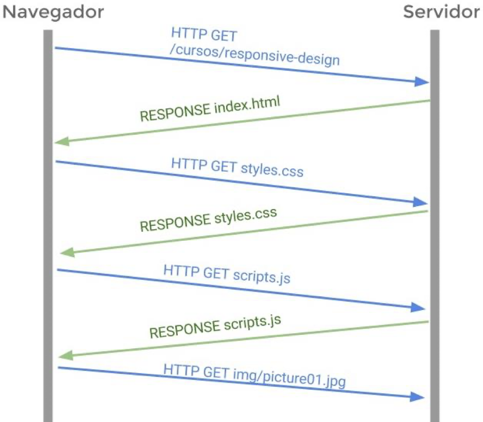

# Introducción a aplicaciones Web

## Aplicación Web 
 
Son aplicaciones desarrolladas utilizando HTML, CSS y JS. 
 
No se requiere un SDK, entorno de desarrollo de software, sino que se programan de manera independiente del sistema operativo donde se va a ejecutar.

No requieren la instalación de la aplicación sobre el dispositivo móvil. Se accede a ellas por medio del navegador a través de la URL del sitio.

 
No se distribuyen por medio de tiendas de aplicaciones, se comercializan y promocionan de manera independiente.

    **Ventajas**
        - Desarrollo más simple
        - No es necesario instalar en el dispositivo, se utiliza en el navegador del mismo
        - Multiplataforma, puede ejecutarse en cualquier dispositivo con acceso a internet
        - Las actualizaciones pueden realizarse en cualquier momento y estar disponibles de inmediato
        - Requieren menos recursos que una App no web
        - Más rápido de poner en marcha
        - Se pueden encontrar con los tradicionales buscadores
        - No necesitan aprobación de ningún fabricante para ser publicadas
    
    **Desventajas**
        - Siempre es necesario estar conectado a Internet
        - Un sitio debe adaptarse a las medidas de un dispositivo movil
        - Algunos de los navegadores móviles son extremadamente simples y básicos
        - No puede acceder a recursos de dispostivos: cámara, acelerómetro, GPS, entre otros
        - Un sitio web móvil es menos atractivo
        - Es necesario conocer la URL
        - La velocidad de ejecución es más lenta que las apps nativas

## Agentes de la web

**Internet:** Red física que conecta millones de computadoras en todo el mundo, a través de dispositivos de HW que envían y reciben datos por diferentes medios para compartir recursos e información 

**Web:** Facilita y define la forma de acceso a los distintos recursos a través de internet. Está basado en el protocolo **HTTP**, que expresa la manera de acceder a la información, permitiendo consulta remota de archivos de hipertexto. Utiliza **INTERNET** como medio de conexión. Funciona bajo el modelo cliente-servidor, en donde una computadora de un usuario (cliente) realiza peticiones a un servidor que almacena los recursos web.

**W3C:** Consorcio creado para fomentar el crecimiento de la web, mediante desarrollo de protocolos y estándares. Permite lograr la accesibilidad, internalización e independencia de los dispositivos.

**Cliente-Servidor:** Modelo que describe interacción entre una computadora local **(cliente)** con una computadora remota **(servidor)** que almacena y hace disponible diferentes recursos. Es un sistema en el cual existen clientes que realizan peticiones a un servidor, el cual procesa dicho requerimiento y retorna los resultados al cliente apropiado. Se dan a través de una RED.

**HTTP**: Protocolo que permite el intercambio de información y es el protocolo de transferencia de hipertexto, el cual permite transferir datos entre navegador y servidor mediante el modelo de petición/respuesta. Cada vez que un servidor recibe una petición HTTP este le devuelve al navegador el recurso solicitado.

Las comunicación cliente-servidor se realiza del siguiente modo:

- Un usuario accede a una URL mediante el navegador, indicando el archivo de hipertexto que desea acceder.
- El navegador decodifica la URL, separando las distintas partes e identificando: protocolo de acceso, dirección IP del servidor, el recurso requerido.
- Se abre una conexión TCP/IP con el servidor.
- Se realiza la petición indicando el tipo de operación HTTP que corresponda (GET, POST, UPDATE, DELETE).
- El servidor devuelve la respuesta al cliente, con le código de estado de la petición, tipo de dato y el dato.
- Finalmente, se cierra la conexión TCP.

Se realizan cuatro peticiones:

1. Documento HTML
2. Archivo con estilos CSS
3. Archivo JavaScript
4. Imagen

**Cliente Web:** Programa que se ejecuta en la computadora de un usuario que solicita a un servidor web el envío de páginas de hipertexto, transfiriendo bajo el protocolo HTTP. Una vez enviada la solicitud queda esperando una respuesta del servidor.

**Navegador:** Aplicación que permite buscar y mostrar el sitio web a los usuarios, encargado de solicitar al servidor web los recursos elegidos por el usuario, y de interpretar y mostrar el contenido al usuario en una ventana, una vez recibida la respuesta del servidor. Se define en las especificaciones de HTML y CSS establecidas por la W3C. La URL permite identificar el recurso que el usuario desea acceder desde el navegador. El navegador inicia la comunicación con el servidor web en el que está alojado el sitio que el usuario desea visitar. El usuario debe conocer el DNS.

**Servidor Web:** Máquina física que posee un determinado sitio web en sus HDD, archivos y BD. Estos archivos se transmiten por Internet a los usuarios cuando acceden desde sus computadoras y dispositivos móviles. Es lo suficientemente grande para almacenar millones de sitios web. Se ejecutan programas de SW que están permanentemente escuchando y respondiendo peticiones realizadas por los clientes web. 

El servidor comienza su ejecución antes de interactuar con el cliente y generalmente se conecta con múltiples usuarios al mismo tiempo.

**Agentes Involucrados de Internet:** Cada dispositivo de HW conectado a la red Internet es identificada por una dirección IP pública única, representada por 4 dígitos separados por puntos.

Al ser difícil de recordar para la mayoría de los usuarios, se estableció el sistema de dominios que referencian a esas direcciones IP.

**TLD:** Dominios de primer nivel que hacen referencia al tipo de servicio que están designados o al pais o región donde se alberga el servicio.

> .com (servicios comerciales)
> 
> .net (servicios orientados a servicio de la red)
> 
> .org (organizaciones sin fines de lucro)
> 
> .edu (servicios educativos)

**ccTLD (Dominios de primer nivel nacionales):** Gestionados por organizaciones del país o región correspondiente, y muchos casos están reservados a empresas y particulares residentes en un país determinado. 

> .ar (Argentina)
> 
> .uy (Uruguay)
> 
> .es (España)

**Servicios DNS:** El nombre de dominio se traduce a un número de IP, es la manera de identificar al servidor que almacena los archivos. Los DNS permiten al navegador conocer la IP de la máquina donde está alojado el dominio al que vamos a acceder.

Es un sistema de nomenclatura jerárquico, un SW que administra el espacio de nombres de dominio. Almacenan una gran base de datos donde mapea un servidor de dominio y su dirección IP

Ejemplo:

**https//www.facebook.com/ = https://157.240.7.35/**

De esta forma los navegadores consumen estos servicios para traducir el nombre de dominio ingresado por el usuario en la dirección IP del servidor que lo almacena y viceversa.

Recursos Web: Se encuentran organizados lógica y jerárquicamente en el sistema de archivos del servidor remoto donde están alojados. Pueden ser HTML, archivos multimedia, JSON, XML, entre otros. Se encuentran identificados por la URL

La URL está conformada por: https://url/carpeta/index.html.

**Hipertexto: Herramienta que permite al usuario interactuar con las páginas a través de enlaces que dirigen a otras páginas. De esta manera se cambia el concepto de como leer la información de un documento web, se puede saltar de una parte a otra del documento, sin orden lógico. Es la base funcional y estructural de la web.**

**Sitios Web dinámicos:** Cuando las páginas web tienen contenidos dinámicos, el 
funcionamiento no es tan lineal como el que vimos 
anteriormente, sino que pueden intervenir otros agentes del 
lado del servidor, para resolver las peticiones del cliente: hay diversidad 
de lenguajes del servidor, lógica de negocios en el servidor, del servidor, acceso a bases de datos, FileServer, comunicación entre servidores, etc.
