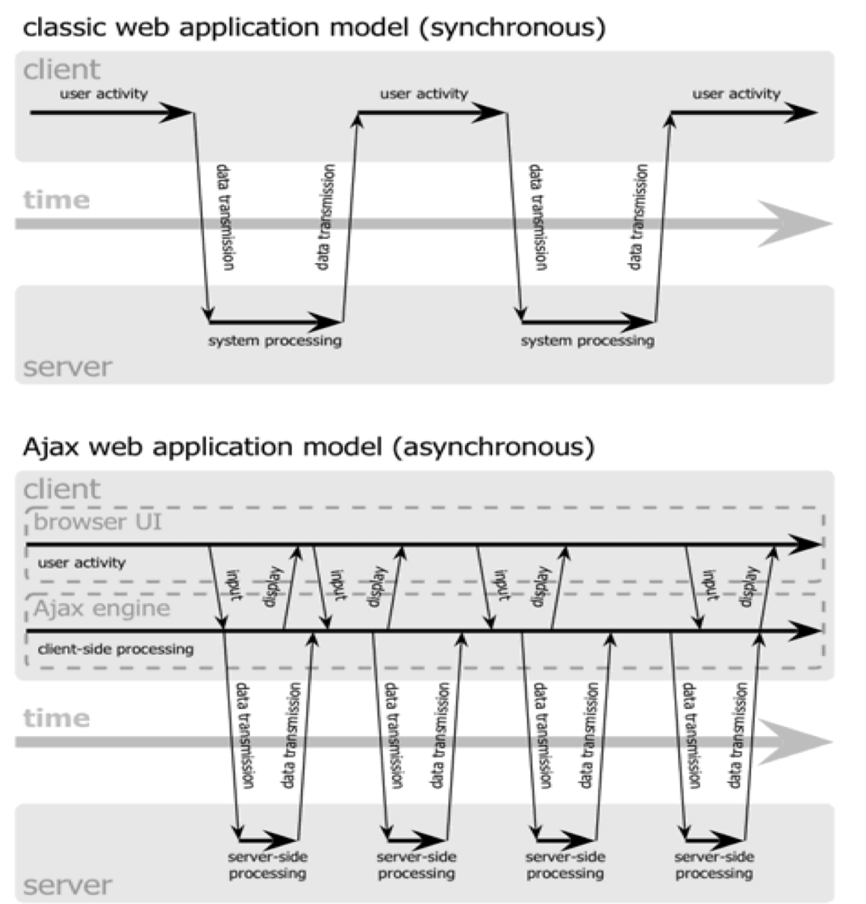

# jQuery

Libreria (deprecada) que permite simplificar el desarrollo del código JS. 

Se utiliza como complemento. Hoy en día se utilizan frameworks como React, Angular, entre otros que permiten facilitar el desarrollo del codigo JS. Además permite simplificar la forma de interactuar con los documentos HTML:

- El acceso a los elementos del DOM.
- Manipulación del CSS.
- Manejo de eventos.
- Desarrollo de efectos y animaciones.
- Integración con tecnología AJAX.

Su comportamiento general se basa en tomar una gran cantidad de tareas comunes que requieren múltiples líneas de código en JS, y las encapsula en un único método que se puede invocar con una sola sentencia desde cualquier punto del documento HTML.

- Reducción del código.
- Mayor facilidad para la programación.
- Código fuente más prolijo.

Todas estas funcionalidades de la librería se definen en un único archivo JavaScript que se debe importar a cada página web en la que se desea utilizarlas.

La sintaxis básica es **$(selector).action(), donde $ define el jquery, selector que referencia elementos HTML y la acción que se realiza sobre el elemento. Permiten seleccionar y manipular elementos del DOM y se puede seleccionar por ID, clase y por atributos.**

**Ventaja**: Es compatible con todos los navegadores, automáticamente detecta el tipo de navegador y realiza las configuraciones necesarias para que funcione correctamente.

## Acciones en JQuery

Para utilizar los manejadores de eventos existen 2 formas de vincularlos:

• **Utilizando un método propio de cada evento:** Se coloca el nombre del evento sin el prefijo “on” y se envía por parámetro el manejador de eventos

```javascript
$(’p’).click(function() {

console.log(’click’);

});
```

- **Utilizando el método bind:** Util para asociar un mismo elemento con múltiples eventos simultáneamente

```javascript
$(’p’).bind({ 

‘click’:function(){accion},

‘mouseover’:function(){accion}

});
```

## Efectos de JQuery

Los efectos se encuentran incorporados en forma de métodos:

**Show()** – Muestra un elemento en pantalla.

**Hide()** – Oculta un elemento seleccionado.

**fadeIn()** – Cambia la opacidad de un elemento al 100% de forma animada.

**fadeOut()** – Cambia la opacidad del elemento al 0% de forma animada.

**SlideDown()** – Aparece el elemento seleccionado con un movimiento de desplazamiento vertical hacia abajo.

**SlideUp()** – Aparece el elemento seleccionado con un movimiento de desplazamiento vertical hacia arriba.

**SlideToogle()** – Oculta o muestra el elemento dependiendo de si está visible o no, respectivamente.

## Modelo asincrónico


**AJAX/await/fetch:** Es una técnica para intercambiar datos entre el cliente y el servidor de forma asíncrona, procesando cualquier solicitud en segundo plano sin recargar toda la página web. Esto permite mejorar la interacción entre usuario y página, mejora la velocidad de respuesta y mejora la usabilidad. Pensar en JSON

Este intercambio de información con el servidor se realiza en segundo plano.

Para eliminar la recarga constante de la página, Ajax crea un elemento intermedio entre el usuario y el servidor. La nueva capa intermedia de AJAX mejora la respuesta de la aplicación, ya que el usuario nunca se encuentra con una ventana del navegador vacía esperando la respuesta del servidor.




- **Fetch**: es la API moderna para peticiones HTTP.
- **Async/await**: es la sintaxis que se usa con Fetch para manejar mejor las promesas y hacer el código más limpio.
- **AJAX**: es la técnica más antigua, con la que se lograba la comunicación asíncrona antes de Fetch.
- **Promise (promesa):** es un objeto que representa un valor que aún no se conoce 

cuando se crea, permitiendo manejar de forma más sencilla operaciones asíncronas como la espera de una respuesta de un servidor

AJAX está compuesto por las siguientes tecnologías:

- XHTML y CSS, para crear una presentación basada en estándares.
- DOM, para la interacción y manipulación dinámica de los datos de visualización.
- XML, XSLT y JSON, para el intercambio y la manipulación de datos.
- XMLHttpRequest, para el intercambio asíncrono de información.
- JavaScript, para unir todas las tecnologías.


**Modelo Convencional vs Modelo Asincrónico**

**Modelo Convencional**

1. Se envía una solicitud HTTP desde el navegador web al servidor.

2. El servidor recibe y, posteriormente, recupera los datos.

3. El servidor envía los datos solicitados al navegador web.

4. El navegador web recibe los datos y vuelve a cargar la página para que aparezcan los datos.

Durante este proceso, los usuarios deben esperar hasta que se complete el proceso. Consume mucho tiempo, y supone una carga innecesaria en el servidor.

**Modelo basado en Ajax**

1. El navegador crea una llamada de JavaScript que luego activará XMLHttpRequest.

2. En segundo plano, el navegador web crea una solicitud HTTP al servidor.

3. El servidor recibe, recupera y envía los datos al navegador web.

4. El navegador web recibe los datos solicitados

5. Los datos son mostrados directamente en la página, sin necesidad de recargarla.

**Funcionamiento general**

Las peticiones Ajax son realizadas por código JavaScript y ejecutadas en el cliente.

El navegador envía la petición Ajax a una URL específica.

Cuando recibe la respuesta del servidor, se ejecuta inmediatamente una función de **callback** que recibe como argumento dicha respuesta y se encarga de procesarla.

Esta respuesta es asíncrona, por lo que hasta que no sea recibida por el navegador, el resto del código de la aplicación continua ejecutándose, sin inferir con la visualización ni el comportamiento de la página.

jQuery provee soporte para AJAX a través del método **$.ajax()**.

La petición se realiza configurando los siguientes atributos del método:

- **Async**: establece si la petición es asincrónica.
- **Data**: información que se enviará al servidor, puede ser un objeto o una cadena de datos.
- **DataType**: tipo de información que se espera recibir como respuesta del servidor.
- **Timeout**: tiempo en milisegundos máximo para considerar la petición fallada.
- **Type**: tipo de la petición HTTP.

Existen métodos más específicos para realizar peticiones, que están basados en el método **$.ajax()**:

- **$.get()** – Realiza una petición GET a una URL determinada.
- **$.post()** – Realiza una petición POST a una URL dada.
- **$.getJSON()** – Realiza una petición GET a una URL provista y espera una respuesta de tipo JSON.
- **$.getScript()** – Añade un script a una página.

Se deben configurar los siguientes parámetros en orden:

**URL (obligatorio) – data – success – datetype**

**JSON (Notacion de objetos de JavaScript):** Formato ligero de intercambio de datos, basado en texto y independiente del lenguaje. Utiliza una sintaxis de clave/valor con llaves para objetos, corchetes para arreglos, y se puede parsear para convertirlo al tipo de datos nativo del lenguaje correspondiente.

Conclusiones:

- Es un protocolo/formato de intercambio de datos ✓
- Se utiliza para serializar/deserializar ✓
- Está basado en clave/valor ✓
- Se utiliza parse para convertir JSON a objeto JavaScript ✓

Las aplicaciones web modernas constantemente intercambian datos con el servidor o con otras aplicaciones.
Para que esto sea posible se debe establecer el protocolo mediante el cual se va a efectuar ese intercambio. Existen una gran variedad de opciones abiertas y estandarizadas, JSON es una de ellas.

**XML:** Al igual que HTML, XML es un lenguaje basado en etiquetas que obtiene su nombre del inglés Extensible Markup Language.

Este lenguaje define un conjunto de reglas para codificar información de manera que sea legible por un ser humano y por un ordenador. Esta información codificada se conoce comúnmente como documento y puede ser usada para representar cualquier estructura de datos.

XML se usa para transmitir información en servicios webs (entre servidores y aplicaciones) y para mantener archivos de configuración.

La fortaleza de XML es el soporte a Unicode, lo que permite escribir la información en cualquier idioma del mundo.

La desventaja es su verbosidad y complejidad, dado que mapear una estructura básica XML a los tipos de datos de un lenguaje de programación o bases de datos puede resultar muy difícil y poco descriptivo. Además, para documentos muy grandes, requiere un uso más intensivo de memoria y procesador.

**YAML:** Es otro formato para el intercambio de información que tiene como objetivo facilitar el mapeo de estructuras de datos más complejas (como listas y arreglos asociativos) en un documento de texto plano legible para un ser humano.

Si bien es un formato joven, sus características le han hecho ganarse un lugar importante en la web, junto con XML y JSON.

Es más estricto que los anteriores pero también más simple. Estas características le otorgan elegancia y claridad, haciéndolo ideal para tareas que involucren intervención de un humano. Luego del salto podrán ver el ejemplo del libro ahora expresado en formato YAML:

La simplicidad le otorga velocidad pero, a diferencia del JSON, no es usado para servicios web o APIs REST sino para archivos de configuración, depuración u otros fines en los que la facilidad de lectura juegan un rol importante.

Además se utiliza en el despliegue de aplicaciones para definirlas y ejecutarlas en múltiples contenedores.

## JSON

Su nombre proviene del inglés JavaScript Object Notation. Es un estándar abierto que utiliza texto plano para codificar información en la forma atributo: valor.

También es ampliamente usado para intercambio de información entre servicios web y APIs REST. Su simplicidad y facilidad de implementación le otorgan un gran desempeño y lo convierten en una de las alternativas ideales al momento de reemplazar XML.

Otras características:

- Aunque en un principio fue considerado como parte de JavaScript, siempre ha sido un estándar **independiente del lenguaje de programación** y se puede utilizar en los más populares.
- Permite el intercambio de datos entre distintas tecnologías. Cada lenguaje tiene su propia librería para codificar y decodificar cadenas de datos JSON.
- Hoy en día, es el más utilizado ya que tiene el formato más liviano, es más fácil de leer y escribir, y de procesar por el navegador.

Cuando se manda o recibe un objeto JSON se puede manejar un objeto a la vez. Hay situaciones en las que se necesita enviar más de un objeto. Por ejemplo: enviar múltiples personas a la vez.

## JSONP


Es un método que permite enviar datos estructurados en formato JSON entre dominios distintos. Las siglas provienen de JSON (JavaScript Object Notation) with Padding (es decir, “JSON con acolchado”). La diferencia entre JSON y JSONP está en la envoltura del objeto.
Para eludir la política de seguridad del mismo origen al solicitar archivos de otros dominios, JSONP no utiliza el objeto XMLHttpRequest como hace el código JSON habitual, sino el elemento script, incluyendo la función de callback. Los scripts sí pueden ser transferidos también entre dominios distintos sin que la SOP sea infringida por ello.

JSONP fue ideado en 2005 por el desarrollador de software Bob Ippolito y ha sido integrado en muchos frameworks de la llamada Web 2.0 como jQuery, como alternativa opcional al JSON convencional.

La solución que ofrece JSONP al obstáculo de la SOP, es utilizar el elemento ```<script>``` para realizar el pedido de datos. 
En el atributo src de este elemento, pueden escribirse dominios que se deseen restricciones de la SOP. Es mediante este atributo que se indica la URL de dominios ajenos, que nos devuelvan el datos JSON. 
En este caso, el script solo va a servir de mensajero para transmitir la solicitud JSONP al servidor web correspondiente.
Para que el cliente pueda procesar los datos más adelante, el servidor los empaqueta como parámetros de una función de JavaScript (función de callback). Esta función está predefinida en el navegador y es transmitida al servidor en la query (como parte de la solicitud) del URL.


¿Cómo mostrar en pantalla el objeto JSON devuelto como resultado por la función ajax?

```javascript
`async function mostrarObjeto() {`

`try {`

`const objetoJSON = await miFuncionAsincrona();`

`*// Espera a que la promesa se resuelva*`

`console.log(objetoJSON);`

`*// El objeto ya está disponible aquí*`

`const jsonString = JSON.stringify(objetoJSON, null, 2);`

`console.log(jsonString);`

`const elemento = document.getElementById('miDiv');`

`if (elemento) {`

`elemento.textContent = jsonString;`

`}`

`} catch (error) {`

`console.error("Error al obtener o mostrar el objeto:", error);`

`}`

`}`

`//`

`*Llama a la función que maneja la espera*`

`mostrarObjeto();`
```