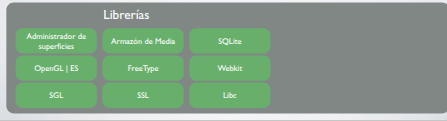
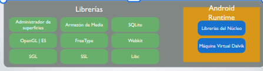
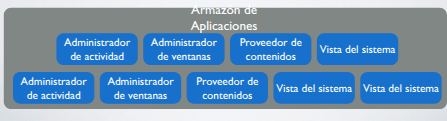
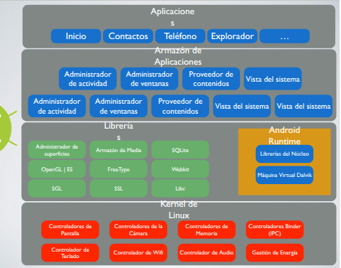
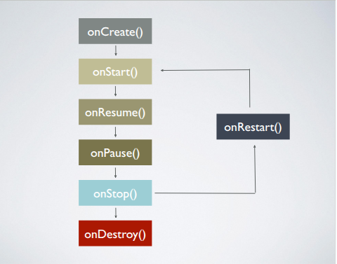

# Android

## Introducción

- Basado en GNU Linux
- Es open-Source, cualquier compañía pueda implementar el código base y adaptarlo a los dispositivos
- Enfocado a dispositivos móviles con pantalla táctil
- Desarrollado por Android Inc y comprado por Google en 2005
- El primer móvil fue el HTC Dream, se lanzó al mercado el 23 de septiembre de 2008 y llevaba la versión 1.0 de Android
- Entre sus principales competencias: iOS, Windows Phone y BlackBerry OS
- Permite programar en un entorno java sobre una máquina virtual Dalvik
- Tiene su propio espacio de comercialización y distribución de aplicaciones llamado “Google Play”
- Es un sistema operativo multitarea
- Permite la descarga de aplicaciones de terceros
   - Ventaja: se pueden probar cualquier tipo de aplicaciones 
   - Desventaja: no se asegura que el software sea malicioso

## Problemas

- Consume mucha energía para poder funcionar
- Actualizaciones del sistema
- Las compañías fabricantes de los dispositivos define si lanza la actualización para el dispositivo

- Se desarrolla de forma abierta:
  - Acceso al código fuente
  - Acceso de lista de incidencias
  - Reportar nuevos problemas
- Distribuciones
  - Cuenta con numerosas versiones desde su liberación inicial
  - Arreglar bugs del Sistema Operativo
  - Incorporar nuevas funcionalidades

## Arquitectura

- Kernel de Linux: debido a su robustez e implementación de servicios:
  - Seguridad
  - Gestión de memoria y procesos
  - Conectividad de red
  - Drivers de comunicación entre dispositivos

Android agrega otras funcionalidades a plataformas móviles para comunicación entre procesos (binder), memoria compartida (ashmem) y gestión de energía (wakelocks)


## Librerías y ejecución

Conjunto de librerías C y C++

Manejo de la pantalla con “Surface manager”

Mapas de bits y tipos de letras con “FreeType”

Gráficos 2D y 3D con “SGL” y “OpenGL”

Manejo multimedia con “Media Framsssework”

Almacenamiento de datos “SQLite”

Motor para vistas web y navegador “WebKit”




## Ejecución

Lograda mediante la máquina virtual Dalvik

Cada aplicación corre su propio proceso, es decir utiliza su	propia instancia de la máquina virtual,

La máquina virtual ejecuta archivos en formato DEX (Dalvik Executable) y el sistema operativo permite la ejecución de múltiples instancias sobre la máquina virtual




## Estructura de las aplicaciones
 - Brinda el contexto para desarrollar aplicaciones
 - Provee api que permite a los desarrolladores aprovechar el sistema de vistas, administrar notificaciones, acceder a los datos a través de los proveedores de contenidos
 - Este mecanismo además permite que cada aplicación publique sus capacidades y que cualquier otra pueda hacer uso de ellas
  



## Aplicaciones

- Teléfono
- Navegador
- Manejo de contactos
- Menú de inicio
  - Las aplicaciones se escriben con el lenguaje de programación Java



## Herramientas de desarrollo

El sistema debe tener instalado:

- Compilador JAVA y máquina virtual (JDK)
- Android Studio + SDK + ADV (emulador)

## Estructura de aplicación

**Proyecto:** Es único y engloba a todos los elementos, dentro del mismo se encuentran distintos módulos.

**Módulo:** Representa distintas aplicaciones, versiones distintas de la misma app o distintos componentes del sistema como librerías o recursos.

El módulo app contiene el SW de la app principal.

Componentes principales del módulo “app”:

**Directorio app/src/main/java** Código fuente de la aplicación

**Directorio app/src/main/res/** Todos los recursos requeridos como imágenes, layouts,	cadenas de texto.. Se dividen en subcarpetas

/res/drawable – imágenes y otros elementos gráficos

/res/mipmap – distintos íconos de la aplicación mostrados en el menú o toolbar

/res/layout/ – archivos XML con las distintas pantallas de interfaz gráfica

/res/color – archivos XML que definen las listas de colores que se aplican a los objetos según su estado

/res/menu – definición XML de los menús de la aplicación

/res/values/ – archivos XML de recursos que utiliza la aplicación como las cadenas de texto (strings.xml), arreglos de valores (arrays.xml), estilos (styles.xml) o colores (colors.xml)

## Layouts

**activity_main** Se define la interfaz gráfica de la pantalla principal

Se puede definir por editor gráfico o por editor de texto que representa los elementos de la misma pantalla

**/app/src/main/AndroidManifest.xml: Contiene las definiciones de configuración básicas de la app en formato XML.**

Los aspectos son:

- Identificación de app (nombre, icono)
- Versión de android
- Declaración de activities y services
- Restricciones y permisos necesario de ejecución
- Interacción con elementos de otras apps.

Es el componente principal del diseño

Define la estructura visual de las actividades

Es el recurso con el que se describe qué se quiere mostrar en pantalla y de qué forma

La forma más común de crearlos es a través de un archivo XML (res/layout)

Se genera una estructura con forma de árbol, donde un nodo raíz contiene sucesivos nodos en los que se colocan otros nodos. Cada nodo representa un objeto “View” o “ViewGroup”

Se separan el diseño de la lógica

XML para la presentación, Java/Kotlin para la lógica de la app. Se deben asociar ambos archivos para que la actividad funcione correctamente.

**La asociación de un Layout con una actividad se hace desde el código, dentro del método onCreate() del archivo Java de la actividad.**

Existen distintos tipos de contenedores: 

- Frame Layout: Es el mas simple, todos los objetos que se introducen, se situarán en la esquina superior izquierda, por lo que si hay más de 1, se solaparán y se ocultarán total o parcial (salvo que se declaren como transparentes). Su uso ideal es mostrar una sola imagen que complete toda la pantalla.
- Linear Layout: Los elementos se posicionan 1 debajo del otro, dependiendo de si se estructuran vertical u horizontalmente (orientation)
- Table Layout: Distribución de tabla de los elementos de la interfaz, donde se definen filas y columnas deseadas. Se utiliza la etiqueta tablerow para insertar una nueva fila.
- Relative Layout: Es la más compleja. Cada elemento se puede colocar en cualquier lugar basado en las posiciones relativas de un elemento respecto de otro: contenedor (padre) o a otros elementos existentes
- **Absolute Layout:** Permite que los elementos se posicionen en la pantalla de acuerdo a las coordenadas (x,y) Al cambiar de dispositivos con distintos tamaños de pantalla el resultado no va a ser el óptimo. Está obsoleto

**/app/build.gradle: Contiene la información de compilación de proyecto**

**Directorio /app/build: Contiene una serie de elementos de código generados automáticamente al compilar el proyecto.**

**R o binding**: Serie de constantes con identificadores de todos los recursos de la app del proyecto app/src/main/res

Desde el código se puede acceder a ellos a partir de este objeto, utilizando notación de puntos. R.layout.activity_main.

## Componentes de una app de Android

Objeto de dispositivos - App mostrada al usuario - App en segundo plano

La pila de tareas es la secuencia de ejecución de procesos en Android, formada por actividades que se van ejecutando a medida que son invocadas.

Cada actividad solo se termina de ejecutar cuando todas las tareas que tiene encima se terminaron de ejecutar o cuando el sistema necesita memoria se fuerza la detención de actividades.

## Actividades

En Android es el equivalente a una pantalla de una aplicación, gestionando la interacción del usuario con una sola ventana.

- Componente principal de una app
- Mostrar al usuario la interfaz gráfica
- Cada aplicación tiene una actividad por cada ventana distinta, y el conjunto de ellas forman la aplicación
- Por si solas, los componentes no pueden hacer funcionar a la aplicación, para ello se requiere de otro componente
- **Es el medio de comunicación entre el usuario y la aplicación**
- Los elementos de una actividad se definen en /res/layout

Cicio de vida de una aplicación

| **ESTADO** | **DESCRIPCIÓN** |
| --- | --- |
| **Activo** | **La actividad está en ejecución, es decir, es la tarea principal** |
| **Pausado** | **La actividad se encuentra semi-suspendida, es decir, aun se está ejecutando, pero no es la tarea principal. Se debe guardar la información en este estado para prevenir una posible pérdida de datos en caso de que el sistema decida prescindir de ella para liberar memoria.** |
| **Parado** | **La actividad está detenida, no es visible al usuario y el sistema puede liberar memoria. En caso de necesitarla de nuevo, será reiniciada desde el principio.** |

Métodos mas importantes de una actividad

| **MÉTODO** | **DESCRIPCIÓN** |
| --- | --- |
| **onCreate()** | **Es el método que crea la actividad. Recibe un parámetro  que contiene el estado anterior de la actividad** |
| **onRestart()** | **Reinicia una actividad tras haber sido parada** |
| **onStart()** | **Inmediatamente después de onCreate o de onRestart() según corresponda. Muestra al usuario la actividad.** |
| **onResume()** | **Establece el inicio de la interactividad entre el usuario y la aplicación** |
| **onPause()** | **Se ejecuta cuando una actividad va a dejar de estar en primer plano, para dar paso a otra.** |
| **onStop()** | **La actividad pasa a un segundo plano por un largo período** |
| **onDestroy()** | **Es el método final de la vida de una actividad** |




## Servicios

Tareas ejecutadas en segundo plano, no requieren una UI, se pueden realizar actividades de cualquier tipo:

- Actualizar datos
- Lanzar notificaciones
- Mostrar elementos visuales

## Intents

Medio de comunicación entre los distintos componentes de android, se utiliza como medio de activación de componentes, contiene datos que indican y describen la operación que va a realizar el componente a quien va dirigido. Se ven como mensajes. Por ejemplo: abrir una nueva actividad, pasar datos entre actividades o iniciar una acción en otra aplicación.

`putExtra` es un método de la clase `Intent` en Android que se usa para adjuntar datos a una intención y enviarlos a otra actividad u otro componente de la aplicación. Funciona como un par clave-valor, donde la "clave" es una cadena (String) que identifica el dato y el "valor" es el dato que se quiere enviar, como texto, números o booleano. Para recuperarlos, el componente receptor usa el método `getExtra()` con la misma clave. 

Views: Componentes de UI, existen distintos tipos de vistas y jerarquías de vistas incluidas en otros grupos

Se definen dentro del layout de cada actividad.

## Content Provider

Mecanismo para compartir datos entre aplicaciones

Su objetivo es que la aplicación pueda acceder a la información que necesita

Se deben declarar en el documento AndroidManifest

El sistema cuenta con proveedores de contenidos de audio y video, y se pueden desarrollar nuevos

## Broadcast Receiver (notificaciones)

Componente para detectar y responder ante determinados mensajes y eventos globales generados por el sistema o por otras apps.

- El sistema puede notificar bateria baja o SMS recibido.
- Apps generan mensajes mediante Intents Broadcast.

No tienen interfaz, pero pueden lanzar actividad por medio de un evento.

## Interfaz de Usuario

Principal medio de comunicación entre el usuario y el dispositivo móvil

Mediante la pantalla
- Se muestran el conjunto de elementos de comunicación
- Se acceden a las funcionalidades disponibles
- Se muestran resultados

La UI permite Manejo intuitivo y sencillo y un diseño visual atractivo

Layout
- LinearLayout
  - RelativeLayout
  - FrameLayout
  - TableLayout
- Controles
  - Buttons
  - TextView
  - Imágenes
  - Checkbox
- Controles de selección
  - Listas
  - Listas desplegables
  - Tablas

Se define a partir de objetos descendientes de clase View

Hay dos tipos de objetos:
- View con los que interactúa el usuario
- ViewGroup que son contenedores de objetos de ambos tipos


<!-- # Translate your site

Let's translate `docs/intro.md` to French.

## Configure i18n

Modify `docusaurus.config.js` to add support for the `fr` locale:

```js title="docusaurus.config.js"
export default {
  i18n: {
    defaultLocale: 'en',
    locales: ['en', 'fr'],
  },
};
```

## Translate a doc

Copy the `docs/intro.md` file to the `i18n/fr` folder:

```bash
mkdir -p i18n/fr/docusaurus-plugin-content-docs/current/

cp docs/intro.md i18n/fr/docusaurus-plugin-content-docs/current/intro.md
```

Translate `i18n/fr/docusaurus-plugin-content-docs/current/intro.md` in French.

## Start your localized site

Start your site on the French locale:

```bash
npm run start -- --locale fr
```

Your localized site is accessible at [http://localhost:3000/fr/](http://localhost:3000/fr/) and the `Getting Started` page is translated.

:::caution

In development, you can only use one locale at a time.

:::

## Add a Locale Dropdown

To navigate seamlessly across languages, add a locale dropdown.

Modify the `docusaurus.config.js` file:

```js title="docusaurus.config.js"
export default {
  themeConfig: {
    navbar: {
      items: [
        // highlight-start
        {
          type: 'localeDropdown',
        },
        // highlight-end
      ],
    },
  },
};
```

The locale dropdown now appears in your navbar:


## Build your localized site

Build your site for a specific locale:

```bash
npm run build -- --locale fr
```

Or build your site to include all the locales at once:

```bash
npm run build
``` -->
