# Android

## Introducción

- Basado en GNU Linux
- Es open-Source, cualquier compañía pueda implementar el código base y adaptarlo a los dispositivos
- Enfocado a dispositivos móviles con pantalla táctil
- Desarrollado por Android Inc y comprado por Google en 2005
- El primer móvil fue el HTC Dream, se lanzó al mercado el 23 de septiembre de 2008 y llevaba la versión 1.0 de Android
- Entre sus principales competencias: iOS, Windows Phone y BlackBerry OS
- Permite programar en un entorno java sobre una máquina virtual Dalvik
- Tiene su propio espacio de comercialización y distribución de aplicaciones llamado “Google Play”
- Es un sistema operativo multitarea
- Permite la descarga de aplicaciones de terceros
   - Ventaja: se pueden probar cualquier tipo de aplicaciones 
   - Desventaja: no se asegura que el software sea malicioso

## Problemas

- Consume mucha energía para poder funcionar
- Actualizaciones del sistema
- Las compañías fabricantes de los dispositivos define si lanza la actualización para el dispositivo

- Se desarrolla de forma abierta:
  - Acceso al código fuente
  - Acceso de lista de incidencias
  - Reportar nuevos problemas
- Distribuciones
  - Cuenta con numerosas versiones desde su liberación inicial
  - Arreglar bugs del Sistema Operativo
  - Incorporar nuevas funcionalidades

## Arquitectura

- Kernel de Linux: debido a su robustez e implementación de servicios:
  - Seguridad
  - Gestión de memoria y procesos
  - Conectividad de red
  - Drivers de comunicación entre dispositivos

Android agrega otras funcionalidades a plataformas móviles para comunicación entre procesos (binder), memoria compartida (ashmem) y gestión de energía (wakelocks)


## Librerías y ejecución

Conjunto de librerías C y C++

Manejo de la pantalla con “Surface manager”

Mapas de bits y tipos de letras con “FreeType”

Gráficos 2D y 3D con “SGL” y “OpenGL”

Manejo multimedia con “Media Framsssework”

Almacenamiento de datos “SQLite”

Motor para vistas web y navegador “WebKit”


## Ejecución

Lograda mediante la máquina virtual Dalvik

Cada aplicación corre su propio proceso, es decir utiliza su	propia instancia de la máquina virtual,

La máquina virtual ejecuta archivos en formato DEX (Dalvik Executable) y el sistema operativo permite la ejecución de múltiples instancias sobre la máquina virtual


## Estructura de las aplicaciones
 - Brinda el contexto para desarrollar aplicaciones
 - Provee api que permite a los desarrolladores aprovechar el sistema de vistas, administrar notificaciones, acceder a los datos a través de los proveedores de contenidos
 - Este mecanismo además permite que cada aplicación publique sus capacidades y que cualquier otra pueda hacer uso de ellas
  


## Aplicaciones

- Teléfono
- Navegador
- Manejo de contactos
- Menú de inicio
  - Las aplicaciones se escriben con el lenguaje de programación Java


## Herramientas de desarrollo

El sistema debe tener instalado:

- Compilador JAVA y máquina virtual (JDK)
- Android Studio + SDK + ADV (emulador)

## Estructura de aplicación

**Proyecto:** Es único y engloba a todos los elementos, dentro del mismo se encuentran distintos módulos.

**Módulo:** Representa distintas aplicaciones, versiones distintas de la misma app o distintos componentes del sistema como librerías o recursos.

El módulo app contiene el SW de la app principal.

Componentes principales del módulo “app”:

**Directorio app/src/main/java** Código fuente de la aplicación

**Directorio app/src/main/res/** Todos los recursos requeridos como imágenes, layouts,	cadenas de texto.. Se dividen en subcarpetas

/res/drawable – imágenes y otros elementos gráficos

/res/mipmap – distintos íconos de la aplicación mostrados en el menú o toolbar

/res/layout/ – archivos XML con las distintas pantallas de interfaz gráfica

/res/color – archivos XML que definen las listas de colores que se aplican a los objetos según su estado

/res/menu – definición XML de los menús de la aplicación

/res/values/ – archivos XML de recursos que utiliza la aplicación como las cadenas de texto (strings.xml), arreglos de valores (arrays.xml), estilos (styles.xml) o colores (colors.xml)


**/app/build.gradle: Contiene la información de compilación de proyecto**

**Directorio /app/build: Contiene una serie de elementos de código generados automáticamente al compilar el proyecto.**

**R o binding**: Serie de constantes con identificadores de todos los recursos de la app del proyecto app/src/main/res

Desde el código se puede acceder a ellos a partir de este objeto, utilizando notación de puntos. R.layout.activity_main.

## Componentes de una app de Android

Objeto de dispositivos - App mostrada al usuario - App en segundo plano

La pila de tareas es la secuencia de ejecución de procesos en Android, formada por actividades que se van ejecutando a medida que son invocadas.

Cada actividad solo se termina de ejecutar cuando todas las tareas que tiene encima se terminaron de ejecutar o cuando el sistema necesita memoria se fuerza la detención de actividades.

## Actividades

En Android es el equivalente a una pantalla de una aplicación, gestionando la interacción del usuario con una sola ventana.

- Componente principal de una app
- Mostrar al usuario la interfaz gráfica
- Cada aplicación tiene una actividad por cada ventana distinta, y el conjunto de ellas forman la aplicación
- Por si solas, los componentes no pueden hacer funcionar a la aplicación, para ello se requiere de otro componente
- **Es el medio de comunicación entre el usuario y la aplicación**
- Los elementos de una actividad se definen en /res/layout

Cicio de vida de una aplicación

| **ESTADO** | **DESCRIPCIÓN** |
| --- | --- |
| **Activo** | **La actividad está en ejecución, es decir, es la tarea principal** |
| **Pausado** | **La actividad se encuentra semi-suspendida, es decir, aun se está ejecutando, pero no es la tarea principal. Se debe guardar la información en este estado para prevenir una posible pérdida de datos en caso de que el sistema decida prescindir de ella para liberar memoria.** |
| **Parado** | **La actividad está detenida, no es visible al usuario y el sistema puede liberar memoria. En caso de necesitarla de nuevo, será reiniciada desde el principio.** |

Métodos mas importantes de una actividad

| **MÉTODO** | **DESCRIPCIÓN** |
| --- | --- |
| **onCreate()** | **Es el método que crea la actividad. Recibe un parámetro  que contiene el estado anterior de la actividad** |
| **onRestart()** | **Reinicia una actividad tras haber sido parada** |
| **onStart()** | **Inmediatamente después de onCreate o de onRestart() según corresponda. Muestra al usuario la actividad.** |
| **onResume()** | **Establece el inicio de la interactividad entre el usuario y la aplicación** |
| **onPause()** | **Se ejecuta cuando una actividad va a dejar de estar en primer plano, para dar paso a otra.** |
| **onStop()** | **La actividad pasa a un segundo plano por un largo período** |
| **onDestroy()** | **Es el método final de la vida de una actividad** |


## Servicios

Tareas ejecutadas en segundo plano, no requieren una UI, se pueden realizar actividades de cualquier tipo:

- Actualizar datos
- Lanzar notificaciones
- Mostrar elementos visuales

## Intents

Medio de comunicación entre los distintos componentes de android, se utiliza como medio de activación de componentes, contiene datos que indican y describen la operación que va a realizar el componente a quien va dirigido. Se ven como mensajes. Por ejemplo: abrir una nueva actividad, pasar datos entre actividades o iniciar una acción en otra aplicación.

`putExtra` es un método de la clase `Intent` en Android que se usa para adjuntar datos a una intención y enviarlos a otra actividad u otro componente de la aplicación. Funciona como un par clave-valor, donde la "clave" es una cadena (String) que identifica el dato y el "valor" es el dato que se quiere enviar, como texto, números o booleano. Para recuperarlos, el componente receptor usa el método `getExtra()` con la misma clave. 

Views: Componentes de UI, existen distintos tipos de vistas y jerarquías de vistas incluidas en otros grupos

Se definen dentro del layout de cada actividad.

## Content Provider

Mecanismo para compartir datos entre aplicaciones

Su objetivo es que la aplicación pueda acceder a la información que necesita

Se deben declarar en el documento AndroidManifest

El sistema cuenta con proveedores de contenidos de audio y video, y se pueden desarrollar nuevos

## Broadcast Receiver (notificaciones)

Componente para detectar y responder ante determinados mensajes y eventos globales generados por el sistema o por otras apps.

- El sistema puede notificar bateria baja o SMS recibido.
- Apps generan mensajes mediante Intents Broadcast.

No tienen interfaz, pero pueden lanzar actividad por medio de un evento.

## Interfaz de Usuario

Principal medio de comunicación entre el usuario y el dispositivo móvil

Mediante la pantalla
- Se muestran el conjunto de elementos de comunicación
- Se acceden a las funcionalidades disponibles
- Se muestran resultados

La UI permite Manejo intuitivo y sencillo y un diseño visual atractivo

Layout
- LinearLayout
  - RelativeLayout
  - FrameLayout
  - TableLayout
- Controles
  - Buttons
  - TextView
  - Imágenes
  - Checkbox
- Controles de selección
  - Listas
  - Listas desplegables
  - Tablas

Se define a partir de objetos descendientes de clase View

Hay dos tipos de objetos:
- View con los que interactúa el usuario
- ViewGroup que son contenedores de objetos de ambos tipos


## Layouts

**activity_main** Se define la interfaz gráfica de la pantalla principal

Se puede definir por editor gráfico o por editor de texto que representa los elementos de la misma pantalla

**/app/src/main/AndroidManifest.xml: Contiene las definiciones de configuración básicas de la app en formato XML.**

Los aspectos son:

- Identificación de app (nombre, icono)
- Versión de android
- Declaración de activities y services
- Restricciones y permisos necesario de ejecución
- Interacción con elementos de otras apps.

Es el componente principal del diseño

Define la estructura visual de las actividades

Es el recurso con el que se describe qué se quiere mostrar en pantalla y de qué forma

La forma más común de crearlos es a través de un archivo XML (res/layout)

Se genera una estructura con forma de árbol, donde un nodo raíz contiene sucesivos nodos en los que se colocan otros nodos. Cada nodo representa un objeto “View” o “ViewGroup”

Se separan el diseño de la lógica

XML para la presentación, Java/Kotlin para la lógica de la app. Se deben asociar ambos archivos para que la actividad funcione correctamente.

**La asociación de un Layout con una actividad se hace desde el código, dentro del método onCreate() del archivo Java de la actividad.**

```java
public void onCreate(Bundle savedInstance) { 
	super.onCreate(savedInstance); 	
	setContentView(R.layout.nombre_del_layout);
}	
```

Existen distintos tipos de contenedores: 

- Frame Layout: Es el mas simple, todos los objetos que se introducen, se situarán en la esquina superior izquierda, por lo que si hay más de 1, se solaparán y se ocultarán total o parcial (salvo que se declaren como transparentes). Su uso ideal es mostrar una sola imagen que complete toda la pantalla.

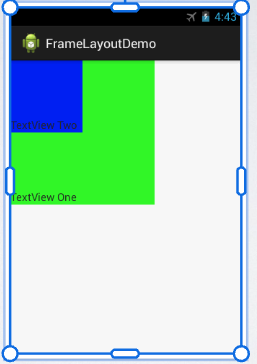


- Linear Layout: Los elementos se posicionan 1 debajo del otro, dependiendo de si se estructuran vertical u horizontalmente (orientation)

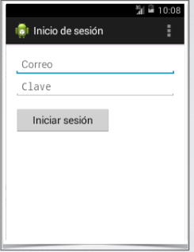

```xml
      <LinearLayout
            style="@style/LoginFormContainer"
            android:orientation="vertical" >

            <EditText
                android:id="@+id/email"
                android:layout_width="match_parent"
                android:layout_height="wrap_content"
                android:hint="@string/prompt_email"
                android:inputType="textEmailAddress"
                android:maxLines="1"
                android:singleLine="true" />

            <EditText
                android:id="@+id/password"
                android:layout_width="match_parent"
                android:layout_height="wrap_content"
                android:hint="@string/prompt_password"
                android:inputType="textPassword"
                android:maxLines="1"
                android:singleLine="true" />

            <Button
                android:id="@+id/sign_in_button"
                android:layout_width="wrap_content"
                android:layout_height="wrap_content"
                android:layout_marginTop="16dp"
                android:paddingLeft="32dp"
                android:paddingRight="32dp"
                android:text="@string/action_sign_in_short" />

        </LinearLayout>

```


- Table Layout: Distribución de tabla de los elementos de la interfaz, donde se definen filas y columnas deseadas. Se utiliza la etiqueta tablerow para insertar una nueva fila.


```xml
<TableLayout
        android:layout_width="fill_parent"
        android:layout_height="fill_parent"
        android:layout_alignParentTop="true"
        android:layout_centerHorizontal="true"
        android:layout_marginTop="33dp" >

        <TableRow
		android:id="@+id/tableRow1"
		android:layout_margin="20dp" >

            <TextView
                android:id="@+id/textView1"
		android:textAppearance="?android:attr/textAppearanceLarge" />

            <TextView
                android:id="@+id/textView2"
		android:textAppearance="?android:attr/textAppearanceLarge" />
        </TableRow>

        <TableRow
		android:id="@+id/tableRow2"
		android:layout_margin="20dp" >

            <TextView
                android:id="@+id/textView3"
		android:textAppearance="?android:attr/textAppearanceLarge" />

            <EditText
                android:id="@+id/editText1"
		android:inputType="text" />
        </TableRow>		
</TableLayout>
```


- Relative Layout: Es la más compleja. Cada elemento se puede colocar en cualquier lugar basado en las posiciones relativas de un elemento respecto de otro: contenedor (padre) o a otros elementos existentes

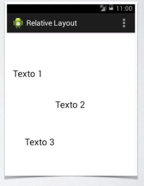


```xml
<RelativeLayout xmlns:android="http://schemas.android.com/apk/res/android"
    xmlns:tools="http://schemas.android.com/tools"
    android:layout_width="match_parent"
    android:layout_height="match_parent"
    >

    <TextView
        android:id="@+id/textView1"
        android:layout_width="wrap_content"
        android:layout_height="wrap_content"
        android:layout_marginTop="70dp"
        android:text="@string/text1"/>

    <TextView
        android:id="@+id/textView3"
        android:layout_width="wrap_content"
        android:layout_height="wrap_content"
        android:text="@string/text3"/>

    <TextView
        android:id="@+id/textView2"
        android:layout_width="wrap_content"
        android:layout_height="wrap_content"
        android:text="@string/text2"/>

</RelativeLayout>
```

- **Absolute Layout:** Permite que los elementos se posicionen en la pantalla de acuerdo a las coordenadas (x,y). Al cambiar de dispositivos con distintos tamaños de pantalla el resultado no va a ser el óptimo. Está obsoleto

- Atributos principales de objetos View: Representan las características que definen el aspecto de los elementos 

android:id Es un identificador único para cada elemento

La sintaxis es la siguiente: 

```xml
android:id="@+id/nombre_identificador"
```
Al compilarse genera automáticamente una nueva constante en la clase R con ese identificador

Desde el código accedemos mediante la constante R.id.nombre_identificador

**android:layout_width y android:layout_height: Representan el ancho y el alto de los elementos, se definen con:**

- valores absolutos definidos en dps

- **wrap_content:** ajusta el tamaño al espacio mínimo requerido por el elemento

- **fill_parent:** Ajusta el tamaño a las dimensiones máximas que el contenedor padre le permite

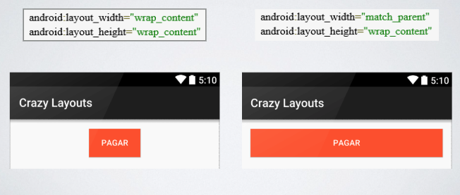


**android:layout_gravity:** Los elementos se ubican a partir de posiciones comunes dentro del layout

Puede tomar los siguientes valores:

- Top: parte superior de la pantalla

- Left: sección izquierda

- Right: sección derecha

- Bottom: parte inferior

- Center: centro del layout

- Combinación de las anteriores

Ejemplo

```xml
android:layout_gravity=right|bottom

```
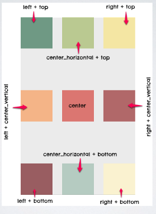

**android:orientation:** Define el modo en el que se distribuyen los elementos que contiene. Puede ser vertical u horizontal

**android:layout_weight:** Define la importancia que tienen los controles. Se usa con LinearLayout. A mayor importancia más espacio ocupa

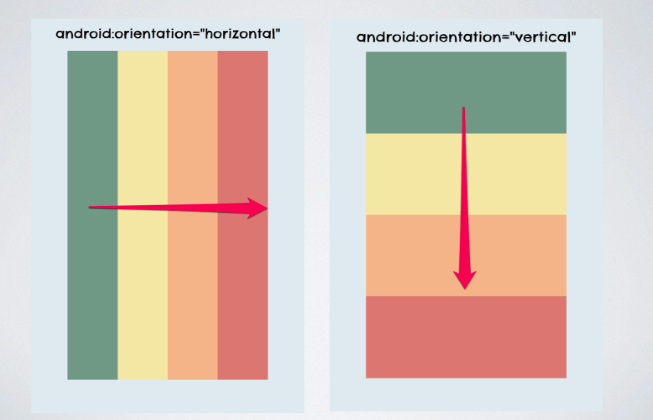

**android:text:** Texto que aparece en el elemento. Se puede definir dentro del archivo “string.xml” correspondiente a los recursos de la actividad
**android:textSize:** Tamaño del texto medido en “dps”
**android:padding** Espacio vacío entre el borde del objeto y su contenido
**android:background:** Configura el color de fondo del View
**android:drawable:** Asigna una imagen al elemento

### Diseño del layout

Está formado por distintas secciones
**Paleta:** se muestran los elementos gráficos
**Lienzo:** representación en tiempo real de la interfaz
**Atributos de componentes:** gestionar atributos y parámetros de los elementos
**Representación de la jerarquía:** Se arma el árbol que representa la relación entre los controles Views que formal el Layout

Modificando el código fuente
Se definen los distintos elementos insertando las etiquetas y configurando sus atributos manualmente
Similar a HTML


## Recursos XML

**Styles.xml:** Se define el aspecto de los elementos
Para separar el contenido de la presentación se puede independizar el estilo del diseño a través del archivo de recursos de estilos
Se logra:

- Reducir, limpiar y simplificar el código fuente
- Reutilizar código y estilos

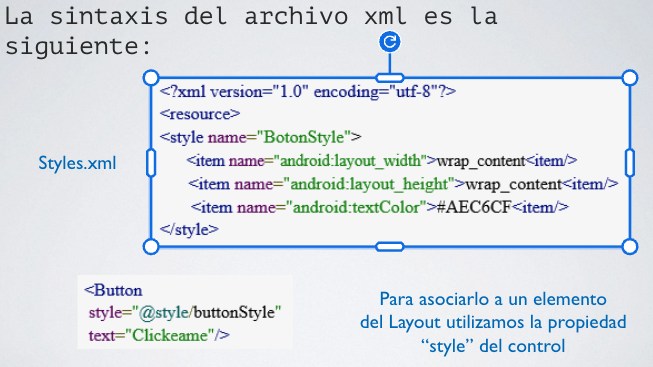

**Se debe crear un nuevo archivo “Styles.xml” en el directorio “res/values/”**

**Strings.xml:** Todos los textos mostrados al usuario se pueden definir en el Layout

Alternativa – Definir todas las cadenas de texto de la aplicación en el archivo “strings.xml” del directorio “/res/values/”

Se logra:

- Definir una cadena de texto (una única vez) para aplicarla en múltiples elementos de la aplicación
- Facilitar las traducciones a otros idiomas

**/res/drawable:** Es el directorio donde se almacenan los gráficos o imágenes que se muestran en pantalla y que se asignan a los objetos definidos en el Layout. Configuración del atributo “android:drawable” o “android:icon”

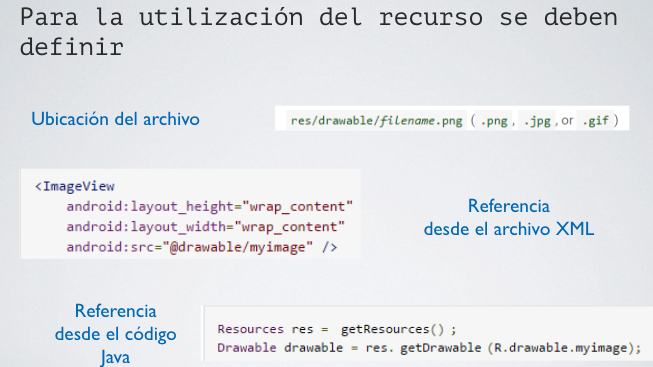


**/res/mipmap:** Directorio donde se almacenan los iconos que se van a mostrar en la app.

## Controles básicos

Botones 

Tres tipos de botones:

- Button: contiene texto 
- ImageButton: contiene sólo una imagen
- ToggleButton: son de tipo on/off
- Switch: igual al anterior pero cambia su aspecto visual

Propiedades:

- id - Identificador
- text - Texto
- typeface, textsize y textcolor
		- Tipo, tamaño y 	color del texto
- layout_width y height - Dimensiones
- background - Color de fondo
- drawable - Imagen


TextView: Utilizado para mostrar textos al usuario. Las propiedades son:

- Texto
- Tipo, tamaño y color de la fuente
- Dimensiones
- Color de fondo

Imagen

**EditView**: Utilizado para que el usuario introduzca texto
Propiedades:
- Mismas que TextView
- inputText - Tipo de contenido
  - Dirección de email
  - Números
  - Teléfonos
  - Dirección web
  - Texto genérico
- Hint y textColorHint - Texto mostrado al usuario antes del ingreso de datos, y su color


ImageView: Utilizado para mostrar imágenes en la aplicación

- Se colocan en el directorio /res/drawable/

Propiedades:
- Dimensiones
- Dimensiones máximas y mínimas
- src: ubicación de la imagen como recurso de la appcontent
- Description: breve descripción textual

## Controles de selección

**Adapter:** Mecanismo por el cual todos los controles de selección acceden a sus datos. Responsable de generar a partir de los datos las vistas que se muestran dentro del control.

Existen tres tipos:

- ArrayAdapter: Provee los datos a partir de un arreglo de objetos
- SimpleAdapter: Mapea los datos definidos en un archivo xml
- SimpleCursorAdapter: Mapea columnas de un cursor abierto sobre una base de datos.

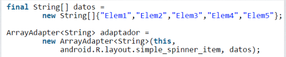


Se pasan tres parámetros:
- Contexto – actividad donde se crea
- Id del Layout – define cómo se van a mostrar los datos en el control
- Arreglo – datos a mostrar

Si los datos del control son estáticos, se puede definir el arreglo de valores en el recurso “/res/values/strings.xml”

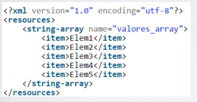


**Spinner:** Muestra una opción seleccionada a partir de una lista desplegable

Propiedades:
- Id
- Las mismas que los controles básicos

Métodos:

- getItemAtPosition() – recupera el dato seleccionado

Se debe asociar el adaptador con el spinner

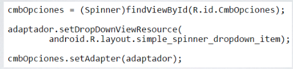


Si lo asociamos directamente:

- El diseño sólo se aplicaría sobre un solo elemento (el seleccionado) de la lista
- Para que se aplique a todos, usamos el método setDropDownViewResource()

Eventos:

Formada por dos métodos:

- onItemSelected() – se selecciona una opción de la lista
- onNothingSelected() – no hay ninguna opción seleccionada


**ListView:** Muestra una lista de opciones que son seleccionables
Propiedades: 

- Las mismas que el Spinner

Métodos:

- getItemAtPosition()

Eventos:

- onItemClick()

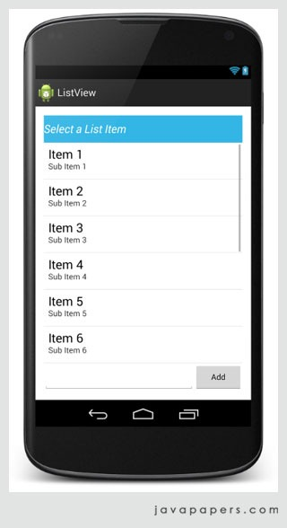


Para asociar el adaptador usamos el método setAdapter()

**GridView:** Presenta un conjunto de opciones seleccionables en forma tabular, divididas en filas y columnas
Propiedades:

- numColumns
- columnWidth
- horizontalSpacing
- verticalSpacing
- stretchMode: define qué hacer con el espacio sobrante (celdas o espacios)

Tiene los mismos métodos y eventos que ListView

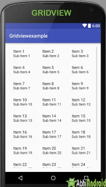


**RecyclerView:** Con Android 5.0 se incroporó un nuevo control de selección
- Combina lo mejor de los ListView y GridView
- Utilizada para mostrar grandes colecciones de datos
- Para acceder y mostrar los datos necesita utilizar otros componentes adicionales
- Tiene su propio adaptador
- El evento onItemClick() no se aplica directamente sobre los elementos, sino que se delega a otro componente

**TabHost** Se utiliza para:
- Organizar mejor la información 
- Dividir la pantalla en múltiples pantallas llamadas pestañas

Para su funcionamiento se debe definir el comportamiento mediante código Java

Se debe definir la propiedad id del control obligatoriamente

La sección principales del control son:

**Sección de pestañas:** Control TabWidget

**Sección de contenido:** Control FrameLayout

## Menu de opciones

- Es un componente que permite mostrar un menú de opciones en forma estandarizada
- La implementación se puede hacer de forma muy similar a la interfaz gráfica de la aplicación
- Con la aparición del Action Bar han caído en desuso

Existen 3 tipos de menús

- Menú principal – aparecen en la parte inferior de la pantalla cuando el usuario presiona la tecla menú del celular
- Submenús – son menús secundarios que se muestran al pulsar una opción del menú principal
- Menú contextual – son los que aparecen al realizar una pulsación larga sobre un elemento de la pantalla

Menú principal
Hay dos maneras de crearlo:

- Definiendo un archivo .xml externo
- Desde el código

Submenu

Se muestran en forma de lista emergente, con el título de la opción elegida del menú principal
Para crearlo usamos el componente `<menu> `dentro del item correspondiente

Para crearlo desde código se usa el método “addSubmenu()” sobre el menu

Menú Contextual
Está asociado a un control específico de la pantalla
Se realizan los siguientes pasos:
1) Asociamos el control en el onCreate() de la actividad
2) Se define el archivo xml con las distintas opciones del menú 
3) En la clase java de la actividad, se sobrescribe el método onCreateContextMenu() 

## Notificaciones

Se utilizan para mostrar mensajes al usuario
Existen dos tipos de mensajes:

**Notificaciones:** Son informativas, no se ejecutan en primer plano y no interactúan inmediatamente con el usuario

**Cuadros de diálogos:** Se ejecutan en primer plano y pueden requerir interacción con el usuario	


**Toast Notification:** Es un mensaje que se muestra en pantalla durante unos segundos y desaparece

Se usan para mostrar mensajes rápidos y sencillos **¡NO SE USA PARA MENSAJES IMPORTANTES!**

**Status Bar:** Son aquellas que se muestran cuando recibimos un mensaje de texto, hay alguna actualización disponible del sistema, tenemos el reproductor de música andando

Están formadas por:

- Icono
- Texto
- Breve mensaje descriptivo
- Fecha y hora

Al hacer click se ejecuta la aplicación que la activó

**Cuadros de diálogo:** Son utilizados para:

- Mostrar mensajes informativos
- Pedir una confirmación rápida
- Solicitar al usuario una elección simple o múltiple entre distintas alternativas

Hay distintos tipos:

**AlertDialog:** Es usado para mostrar un mensaje sencillo al usuario con un único botón para confirmar su lectura

**Dialogo de confirmación:** Es usado para solicitar al usuario que confirme una determinada acción con dos posibles respuestas: ACEPTAR y CANCELAR

**Dialogo de selección:** Es usado cuando las opciones a seleccionar por el usuario son más de dos, mostrando una lista de opciones

## Fragments

Aplicaciones con interfaz de usuario adaptable a las dimensiones del dispositivo.

**Es una sección o porción modular de una UI que posee su propio funcionamiento**

Se pueden obtener diferentes diseños de pantalla de acuerdo al tamaño y a la orientación del dispositivo

Están embebidas en una actividad. 

Tienen su propio ciclo de vida

Tiene su archivo XML asociado en el directorio /res/layout/ y un .Java para definir su comportamiento

Se asocian a las actividades directamente utilizando el elemento `<fragment>` en el layout o en la implementación de la lógica de la actividad

Se pueden:

- Combinar múltiples Fragments en una actividad
- Reutilizar en múltiples actividades

Disponible a partir de la versión 3.0 de Android

Ventajas de Fragments

- Apps adaptables a distintas dimensiones de pantalla y orientación
- Creación de diseños de múltiples vistas
- Diseños más flexibles y dinámicos
- Ejemplos, pestañas de navegación, stacking, expand and collapse, etc.

Ciclo de vida: Depende del ciclo de vida de una actividad

- Ejecución: Los fragmentos pueden actuar libremente
- Pausado: Todos los fragmentos detienen su comportamiento
- Detenido: Idem anterior

| Metodo | Descripción |
| --- | --- |
onAttach() |	Permite asociar el fragmento a la actividad
onActivityCreated()	| Se ejecuta cuando la actividad termina la ejecución de su método onCreate()
onCreateView () |	Se llama cuando el fragmento se va a dibujar por primera vez al usuario
onPause()	| Se ejecuta cuando un fragmento deja de estar en primer plano
onDestroyView()	| Se destruye la jerarquía de Views del fragmento
onDetach() |	Se elimina el vínculo entre la actividad y el fragmento
onBindViewHolder | método en Android que se utiliza en RecyclerView. Adapter para actualizar los datos de una vista existente que se está reutilizando para mostrar un nuevo elemento de la lista.


Utilización

- Aplicaciones Maestro – Detalle
- En una pantalla se muestra una lista de ítems, al seleccionar uno de ellos se despliega el detalle de los mismos

- Ejemplo
	- Aplicación de correo electrónico
	-	Se muestra un listado con todos los emails recibidos, y al seleccionar uno muestra su contenido

Creación de fragments

Se requieren dos archivos:

- XML – ubicado en /res/layout
- Java – define la clase que lo representa, debe extender de la clase Fragment

Para asociar el Fragment con la actividad

- Desde el Layout

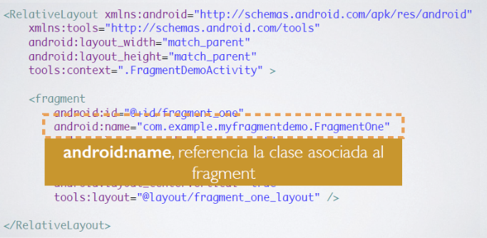

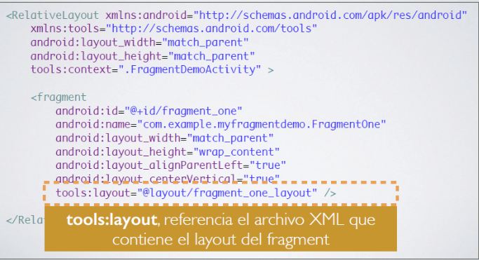

Si se agrega el fragment desde el layout de la actividad no se lo puede eliminar ni reemplazar en tiempo de ejecución


- Desde el código

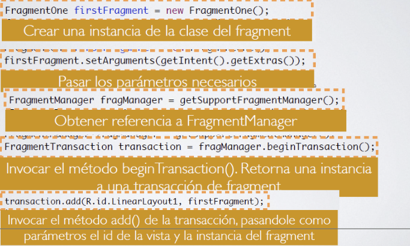
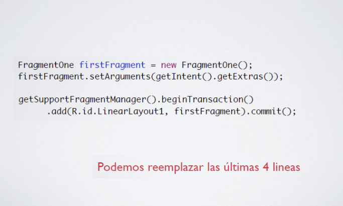

Otras operaciones


## Eventos

Se gestionan de acuerdo a los siguientes criterios
Si se declara el Listener en la clase del Fragment, el evento será manejado por el Fragment

Si se utiliza la propiedad onClick() lo manejará la Activity

## Comunicación entre fragment y actividad

La comunicación entre el fragment y la actividad se puede dar en dos sentidos:
Activity – Fragment
		La actividad debe identificar al fragmento mediante
- ID  - findFragmentById()
- Etiqueta - findFragmentByTag()
- Fragment – Activity: El fragment debe definir una interface Listener que luego será implementada en la actividad

## Master/Detail

- Concepto de diseño de interfaz donde se muestra una lista de ítems (Maestro) 
- Al seleccionar un elemento de la lista se despliega el detalle correspondiente
- El diseño se ajusta automáticamente a la pantalla del dispositivo
- Es útil para desarrollar aplicaciones para Tablets y Smartphones
- Está basado en Fragments

## Action Bar

- Representa la barra de títulos y herramientas que aparece en la parte superior de la pantalla
- Su incorporación comenzó a reemplazar la utilización del menú
- Normalmente muestra el título de la aplicación o de la actividad en la que se encuentra el usuario, una serie de botones y un menú desplegable

Para poder utilizar esta herramienta, en el archivo “build.gradle” se debe agregar la dependencia

compile 'com.android.support:appcompat-version'

Existen dos tipos:

- Action Bar por defecto: Controlar el tema utilizado por la aplicación
	
```xml
<resources>
  <style name="Apptheme" parent="Theme.AppCompat.Light.DarkActionBar"></style>
</resources>

```

b) Las actividades deben extender de la clase AppCompactActivity


```java
import android.support.v7.app.AppCompatActivity;
public class MainActivity extends AppCompatActivity{

}

```

- Toolbar: 
  - “Desactivar” la funcionalidad por defecto del Action bar.. El tema utilizado por la aplicación debe extender de:
    - Theme.AppCompact.NoActionBar
    - Theme.AppCompat.Light.NoActionBar
  - Incluir el Toolbar manualmente como primer elemento del Layout
  - El menú desplegable lo definimos del mismo modo que en el caso anterior
  - Asociar el Toolbar con la actividad

Para no definir el Toolbar en todas las actividades, se declara como un layout independiente y se referencia desde el layout de cada actividad con la cláusula “include”

## Geolocalización

- Es un servicio que permite obtener la localización geográfica del dispositivo

- Existen varias formas de obtener la ubicación de un dispositivo:
  - GPS – exacta
  - Antenas de telefonía móvil
  - Puntos de acceso de wifi

- LocationManager

  - Provee acceso al servicio de localización
  - No se instancia directamente, sino que se recupera la instancia a partir de:
  - ContextgetSystemService(Context.LOCATION_SERVICE)

-LocationListener

  - Utilizada para recibir notificaciones del LocationManager cuando las coordenadas han cambiado
  - Se debe asociar al LocationManager a través del método requestLocationUpdates

Pasos para probar la geolocalización

- Verificar que el servicio está activo
- Suscribirse a las notificaciones de cambio de posición mediante el método requestLocationUpdates() que recibe cuatro parámetros
- Nombre del proveedor de localización
- Tiempo mínimo entre actualizaciones (ms)
- Distancia mínima entre actualizaciones (mts)
- Instancia de objeto LocationListener


El objeto LocationListener tiene cuatro métodos asociados a los eventos recibidos del proveedor 

- onLocationChanged() – se recibe una actualización de posición
- onProviderDisabled() – el proveedor se deshabilita
- onProviderEnabled() – el proveedor se activa
- onStatusChanged() – el estado cambia


<!-- # Translate your site

Let's translate `docs/intro.md` to French.

## Configure i18n

Modify `docusaurus.config.js` to add support for the `fr` locale:

```js title="docusaurus.config.js"
export default {
  i18n: {
    defaultLocale: 'en',
    locales: ['en', 'fr'],
  },
};
```

## Translate a doc

Copy the `docs/intro.md` file to the `i18n/fr` folder:

```bash
mkdir -p i18n/fr/docusaurus-plugin-content-docs/current/

cp docs/intro.md i18n/fr/docusaurus-plugin-content-docs/current/intro.md
```

Translate `i18n/fr/docusaurus-plugin-content-docs/current/intro.md` in French.

## Start your localized site

Start your site on the French locale:

```bash
npm run start -- --locale fr
```

Your localized site is accessible at [http://localhost:3000/fr/](http://localhost:3000/fr/) and the `Getting Started` page is translated.

:::caution

In development, you can only use one locale at a time.

:::

## Add a Locale Dropdown

To navigate seamlessly across languages, add a locale dropdown.

Modify the `docusaurus.config.js` file:

```js title="docusaurus.config.js"
export default {
  themeConfig: {
    navbar: {
      items: [
        // highlight-start
        {
          type: 'localeDropdown',
        },
        // highlight-end
      ],
    },
  },
};
```

The locale dropdown now appears in your navbar:


## Build your localized site

Build your site for a specific locale:

```bash
npm run build -- --locale fr
```

Or build your site to include all the locales at once:

```bash
npm run build
``` -->
